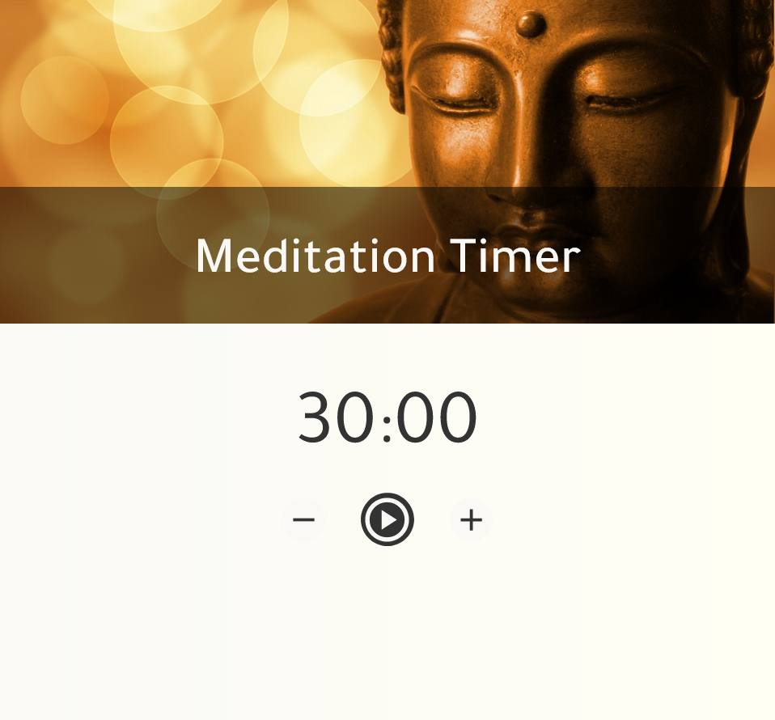

# Meditation Timer
A simple meditation timer

## Table of contents

- [Overview](#overview)
  - [Project Description](#project-description)
  - [Screenshot](#screenshot)
  - [Links](#links)
- [My process](#my-process)
  - [Built with](#built-with)
  - [What I learned](#what-i-learned)
  - [Future plans for this project](#future-plans-for-this-project)
  - [Useful resources](#useful-resources)
- [Author](#author)

## Overview

### Project Description

This is a simple meditation timer. Right now it only allows the user to meditate for 30 minutes. There is a start button, which when clicked turns into the stop button, and starts the timer running. The timer updates itself on the screen so you can see how much time is remaining. The timer also plays bells at the start and end of meditation. The current tone and configuration of the bells is Zen style - I may allow some flexibility for the bells in future updates.

### Screenshot

### Links

- Project URL: [https://github.com/zoedarkweather/meditation-timer](https://github.com/zoedarkweather/meditation-timer)
- Live Site URL: [https://meditation-timer-six.vercel.app/](https://meditation-timer-six.vercel.app//)

## My process

### Built with

- Semantic HTML5 markup
- CSS custom properties 
- Mobile-first workflow
- JavaScript

### What I learned
I learned that although setInterval seemed like what would be needed, I instead needed to use nested calls to setTimeout so that I could adjust for lag time. Apparently both of these methods lag for all sorts of reasons and are not designed to be "accurate." Apparently, this is a “this code will execute after at least this interval has passed,” situation, not a “this code will execute after exactly this interval” situation. So I added a few lines to my timer to track about how long the actual execution time was and how far off it was from ideal and compensate. It’s not perfect, but I don’t have to worry about it getting too far off, and a few milliseconds is not going to be perceptible to anyone using it.

I also learned a little more about function scope and how to use .bind(). When I put my timer code inside a method of my timer class, it stopped working. It took me a bit to figure out that it was because it was losing its context when it got passed to setTimeout. Binding it to the timer instance fixed the issue.

### Future plans for this project
I plan on adding a way for the user to change the meditation time, change or remove the starting bells, change the ending bells, and maybe changing it to start/pause with a reset button instead of stopping and starting over.  
 
### Useful resources

#### These helped me learn how to use setTimeout and setInterval

- [https://javascript.info/settimeout-setinterval](https://javascript.info/settimeout-setinterval) 

- [https://developer.mozilla.org/en-US/docs/Web/API/setTimeout](https://developer.mozilla.org/en-US/docs/Web/API/setTimeout) 

#### These helped me resolve the method scope issue

- [https://developer.mozilla.org/en-US/docs/Web/JavaScript/Reference/Operators/this](https://developer.mozilla.org/en-US/docs/Web/JavaScript/Reference/Operators/this)

- [https://www.w3schools.com/js/js_function_bind.asp](https://www.w3schools.com/js/js_function_bind.asp)

## Author

- Github - [Jennifer Souza](https://github.com/zoedarkweather)